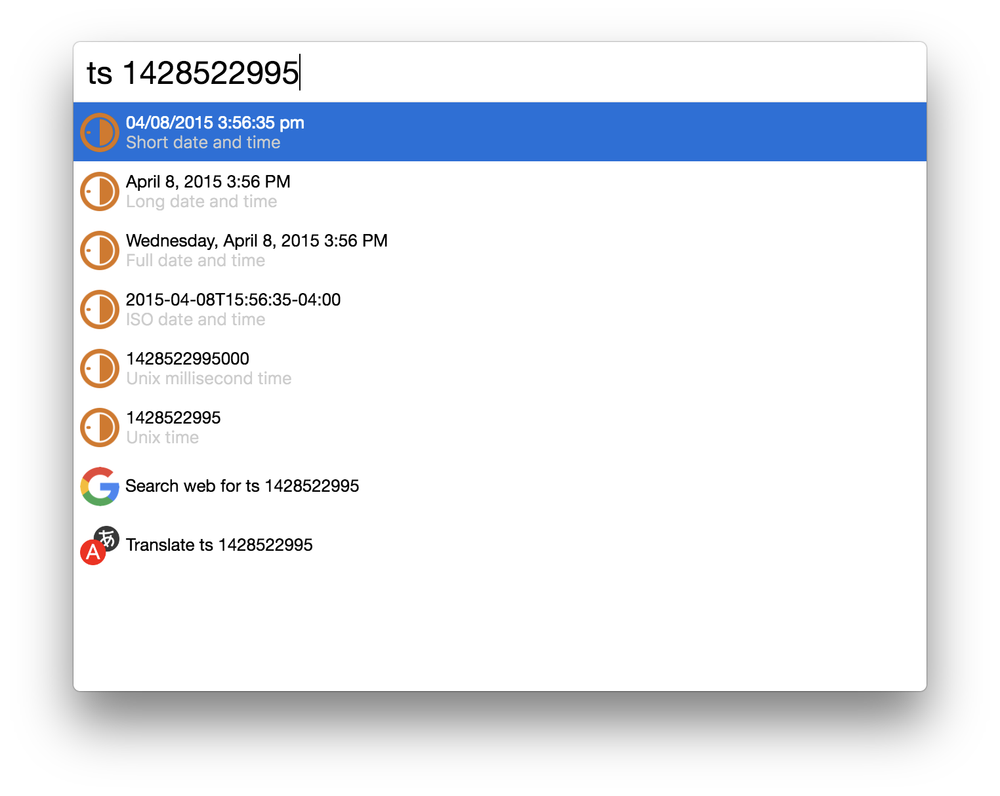
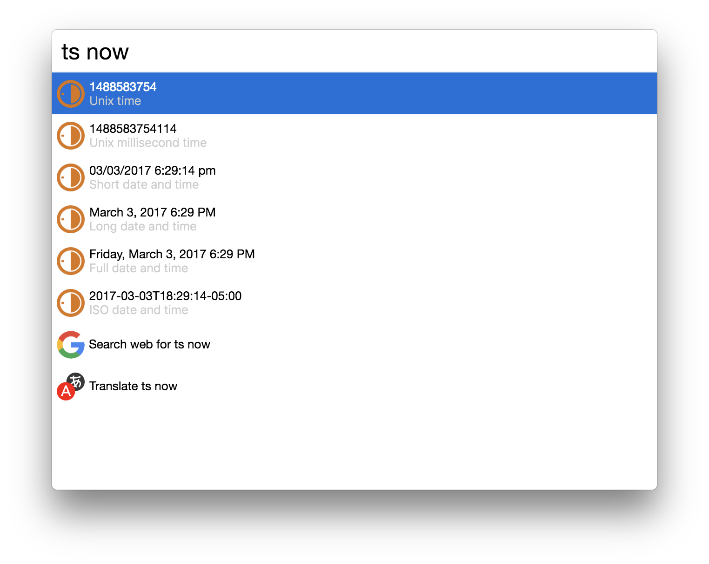
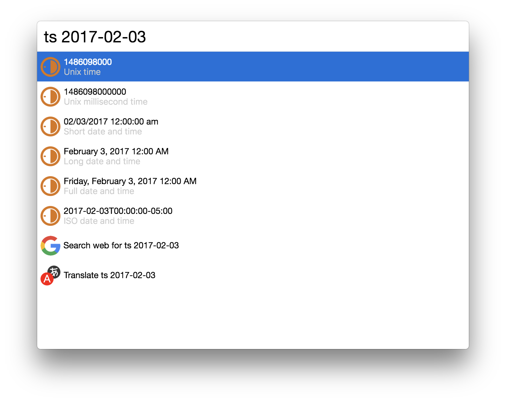

# cerebro-timestamp

> [Cerebro](https://cerebroapp.com) plugin to encode/decode timestamps and dates

## Usage

In Cerebro, type a timestamp (Unix time), or `ts` and a timestamp (Unix time) or a date to encode/decode it. Use <kbd>⌘+C</kbd> or <kbd>↩</kbd> to copy the default result value to clipboard or go down first to select a value to copy.

 - Number of *seconds* since epoch:  
 `1488570776` => 2017-03-03T19:52:56Z  
 `ts 1488570776` => 2017-03-03T19:52:56Z  

 - Number of *milliseconds* since epoch:  
 `1488570776213` => 2017-03-03T19:52:56Z  
 `ts 1488570776213` => 2017-03-03T19:52:56Z  

 - Date in the Y-m-d format:  
 `ts 2017-03-03` => 1488570776

 - Current date:  
 `ts now` => All outputs for the current timestamp

Available outputs are:
- Readable date: `2017-03-03 7:52:56 pm` (based on the current locale)
- ISO 8601: `2017-03-03T19:52:56Z`
- Unix time: `1488570776`
- Unix millisecond time: `1488570776213`
- Long Date: `March 3, 2017 7:52 PM`
- Full Date: `Friday, March 3, 2017 7:52 PM`

The default output will depend on the input.

This plugin is using the [MomentJS](https://github.com/moment/moment) module to handle the dates.  

 More infos about `timestamp` or `Unix time` here: [https://wikipedia.org/wiki/Unix_time](https://en.wikipedia.org/wiki/Unix_time)

## Installing

* Type `plugins timestamp` into Cerebro
* Click `install`

## Related

- [Cerebro](http://github.com/KELiON/cerebro) – main repo for Cerebro app;

## License

MIT © [Benoit Zohar](https://github.com/benoitzohar)
